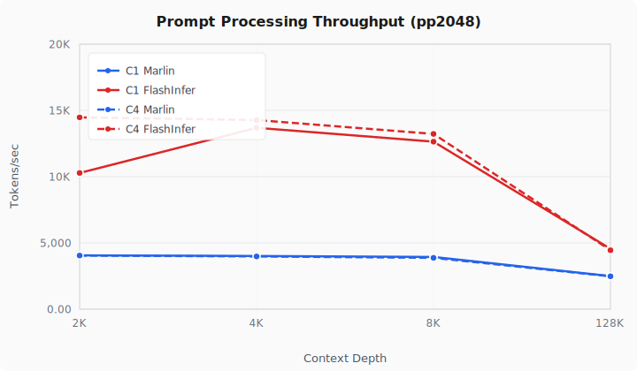
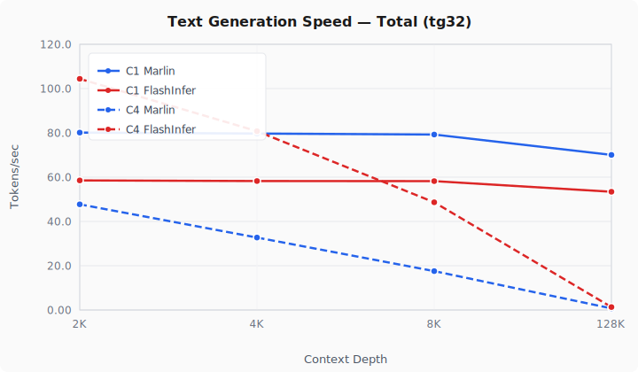
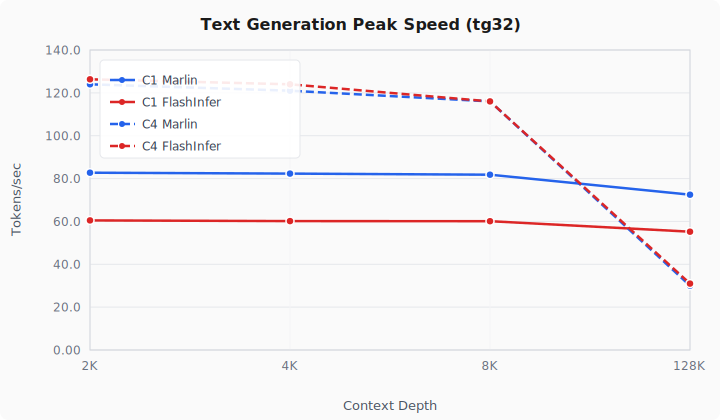
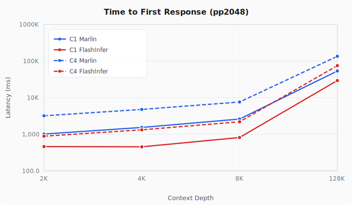
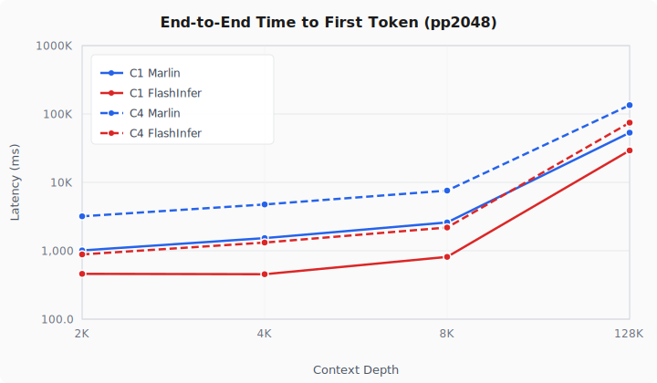
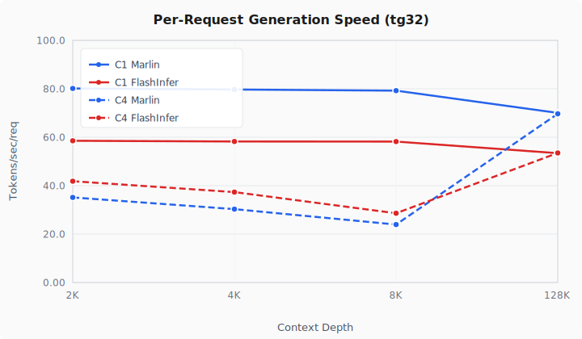
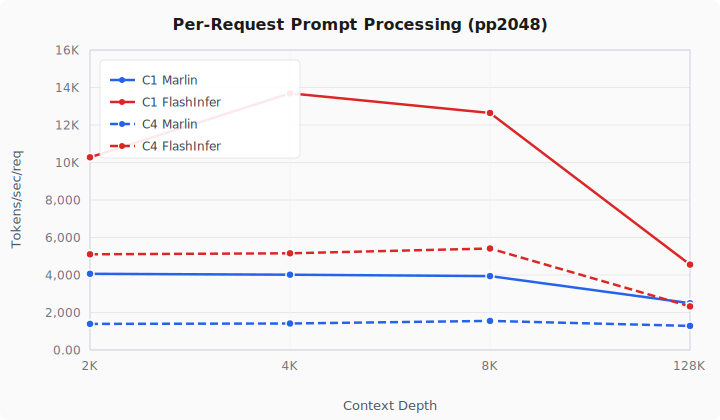

# Qwen3.5-27B-NVFP4 on RTX 5090 with vLLM

Run [Qwen3.5-27B](https://huggingface.co/Qwen/Qwen3.5-27B) (Mamba-hybrid, 27B dense) on a single **NVIDIA RTX 5090** (32 GB) using [vLLM](https://github.com/vllm-project/vllm) with **NVFP4 quantization**.

## ⚡ Performance

Benchmarked on a single RTX 5090 (32 GB) with [llama-benchy](https://github.com/eugr/llama-benchy) using the [Kbenkhaled/Qwen3.5-27B-NVFP4](https://huggingface.co/Kbenkhaled/Qwen3.5-27B-NVFP4) checkpoint.

| Metric | 4K Context | 8K Context | 128K Context |
|---|---|---|---|
| **Prompt processing** (pp2048) | 4,016 t/s | 3,943 t/s | 2,496 t/s |
| **Text generation** (tg32) | 80 t/s | 79 t/s | 70 t/s |
| **Time to first token** | 1,534 ms | 2,602 ms | 53,345 ms |

> **~80 tokens/sec generation speed** — fast enough for real-time interactive use (default Marlin backend).

## Features

- 229K context length with FP8 KV cache
- NVFP4 quantization with selectable GEMM backend (Marlin or FlashInfer-CUTLASS)
- Works out of the box with vLLM v0.17+ — no patches or custom builds needed
- Uses the official `vllm/vllm-openai:cu130-nightly` Docker image

## GPU Compatibility

> **⚠️ This setup is tested and verified on NVIDIA RTX 5090 only.**

NVFP4 quantization requires Blackwell architecture FP4 tensor core instructions. Additionally, the `vllm/vllm-openai:cu130-nightly` Docker image ships with PyTorch kernels compiled for **SM 12.0**, which matches the RTX 5090 but may not work on other Blackwell GPUs with different compute capabilities (e.g. DGX Spark GB10 is SM 12.1).

## Quick Start

```bash
# Clone this repo
git clone https://github.com/Li-Lee/vllm-qwen3.5-nvfp4-5090.git
cd vllm-qwen3.5-nvfp4-5090

# Create your .env from the template
cp .env.example .env
# Edit .env with your HF token and cache path
vim .env

# Start the server
docker compose up -d

# Check logs (model loading takes ~5-10 min on first run)
docker compose logs -f
```

The OpenAI-compatible API will be available at `http://localhost:8000`.

## Configuration

All user-specific settings live in `.env` (see [`.env.example`](.env.example)):

| Variable | Description |
|---|---|
| `HF_TOKEN` | Your [Hugging Face token](https://huggingface.co/settings/tokens) (required for gated models) |
| `HF_CACHE` | Path to your local HF cache directory (e.g. `/home/user/.cache/huggingface`) |
| `NVFP4_BACKEND` | NVFP4 GEMM backend: `marlin` (default, better decode) or `flashinfer-cutlass` (better prefill) |

### Key vLLM Parameters

| Parameter | Value | Notes |
|---|---|---|
| `--max-model-len` | `234567` | 229K context window |
| `--gpu-memory-utilization` | `0.89` | ~28.5 GB of 32 GB VRAM |
| `--max-num-seqs` | `4` | Max concurrent sequences |
| `--max-num-batched-tokens` | `4096` | Per-batch token budget |

## About the Patch (vLLM v0.16 only)

> **vLLM v0.17+ has fixed this issue natively — the patch is no longer needed.** The default `docker-compose.yml` uses v0.17+ and does not include the patch.

The Qwen3.5 Mamba-hybrid architecture has layers that must remain in BF16 even when the rest of the model is NVFP4-quantized. In vLLM v0.16, the HuggingFace-to-vLLM name mapping didn't correctly translate the checkpoint's quantization ignore list for this architecture. The included `fix_linear_attn_nvfp4_exclusion.py` patched vLLM at container startup to:

1. **Exclude BF16 layers** from NVFP4 quantization: `linear_attn` (Mamba), `shared_expert_gate`, `.mlp.gate` (MoE router), and `mtp.*` layers
2. **Handle weight size mismatches** gracefully during loading, re-materializing affected parameters as unquantized tensors

vLLM v0.17 fixed this upstream via [`apply_vllm_mapper`](https://github.com/vllm-project/vllm/issues/28072), which now properly translates the exclude_modules list from HF names to vLLM names.

If you need to use vLLM v0.16, use the legacy configuration:

```bash
docker compose -f docker-compose.v16.yml up -d
```

## Benchmark

Tested on a single NVIDIA RTX 5090 (32 GB) using [llama-benchy](https://github.com/eugr/llama-benchy):

### Charts

#### Prompt Processing Throughput (pp2048 t/s)


#### Text Generation Speed — Total (tg32 t/s)


#### Text Generation Peak Speed (tg32 peak t/s)


#### Time to First Response (ms, log scale)


#### End-to-End Time to First Token (ms, log scale)


#### Per-Request Generation Speed (tg32 t/s)


#### Per-Request Prompt Processing (pp2048 t/s)


### Raw Data

#### Concurrency = 1

```bash
uvx llama-benchy --base-url http://localhost:8000/v1 --model Kbenkhaled/Qwen3.5-27B-NVFP4 --depth 2048 4096 8192 131072 --concurrency 1
```

VLLM_NVFP4_GEMM_BACKEND=marlin
| model                        |             test |             t/s |     peak t/s |         ttfr (ms) |      est_ppt (ms) |     e2e_ttft (ms) |
|:-----------------------------|-----------------:|----------------:|-------------:|------------------:|------------------:|------------------:|
| Kbenkhaled/Qwen3.5-27B-NVFP4 |   pp2048 @ d2048 |  4061.39 ± 9.38 |              |    1012.92 ± 2.44 |    1008.69 ± 2.44 |    1013.21 ± 2.47 |
| Kbenkhaled/Qwen3.5-27B-NVFP4 |     tg32 @ d2048 |    80.12 ± 0.20 | 82.76 ± 0.20 |                   |                   |                   |
| Kbenkhaled/Qwen3.5-27B-NVFP4 |   pp2048 @ d4096 |  4016.16 ± 2.91 |              |    1534.21 ± 1.13 |    1529.99 ± 1.13 |    1534.34 ± 1.15 |
| Kbenkhaled/Qwen3.5-27B-NVFP4 |     tg32 @ d4096 |    79.69 ± 0.08 | 82.31 ± 0.08 |                   |                   |                   |
| Kbenkhaled/Qwen3.5-27B-NVFP4 |   pp2048 @ d8192 |  3942.72 ± 5.63 |              |    2601.76 ± 3.70 |    2597.53 ± 3.70 |    2601.91 ± 3.70 |
| Kbenkhaled/Qwen3.5-27B-NVFP4 |     tg32 @ d8192 |    79.22 ± 0.16 | 81.83 ± 0.17 |                   |                   |                   |
| Kbenkhaled/Qwen3.5-27B-NVFP4 | pp2048 @ d131072 | 2495.71 ± 10.32 |              | 53344.75 ± 219.70 | 53340.52 ± 219.70 | 53344.93 ± 219.72 |
| Kbenkhaled/Qwen3.5-27B-NVFP4 |   tg32 @ d131072 |    70.04 ± 0.13 | 72.49 ± 0.13 |                   |                   |                   |

VLLM_NVFP4_GEMM_BACKEND=flashinfer-cutlass
| model                        |             test |                t/s |     peak t/s |         ttfr (ms) |      est_ppt (ms) |     e2e_ttft (ms) |
|:-----------------------------|-----------------:|-------------------:|-------------:|------------------:|------------------:|------------------:|
| Kbenkhaled/Qwen3.5-27B-NVFP4 |   pp2048 @ d2048 | 10276.71 ± 3209.26 |              |   460.19 ± 182.64 |   455.67 ± 182.64 |   460.41 ± 182.68 |
| Kbenkhaled/Qwen3.5-27B-NVFP4 |     tg32 @ d2048 |       58.54 ± 0.14 | 60.46 ± 0.14 |                   |                   |                   |
| Kbenkhaled/Qwen3.5-27B-NVFP4 |   pp2048 @ d4096 |   13688.11 ± 16.56 |              |     453.48 ± 0.51 |     448.95 ± 0.51 |     453.63 ± 0.51 |
| Kbenkhaled/Qwen3.5-27B-NVFP4 |     tg32 @ d4096 |       58.23 ± 0.06 | 60.14 ± 0.06 |                   |                   |                   |
| Kbenkhaled/Qwen3.5-27B-NVFP4 |   pp2048 @ d8192 |   12640.29 ± 19.36 |              |     814.68 ± 1.25 |     810.16 ± 1.25 |     814.86 ± 1.23 |
| Kbenkhaled/Qwen3.5-27B-NVFP4 |     tg32 @ d8192 |       58.19 ± 0.06 | 60.09 ± 0.06 |                   |                   |                   |
| Kbenkhaled/Qwen3.5-27B-NVFP4 | pp2048 @ d131072 |    4552.98 ± 55.59 |              | 29247.07 ± 355.60 | 29242.54 ± 355.60 | 29247.22 ± 355.60 |
| Kbenkhaled/Qwen3.5-27B-NVFP4 |   tg32 @ d131072 |       53.39 ± 0.08 | 55.19 ± 0.08 |                   |                   |                   |

#### Concurrency = 4

```bash
uvx llama-benchy --base-url http://localhost:8000/v1 --model Kbenkhaled/Qwen3.5-27B-NVFP4 --depth 2048 4096 8192 131072 --concurrency 4
```

VLLM_NVFP4_GEMM_BACKEND=marlin
| model                        |                  test |     t/s (total) |        t/s (req) |      peak t/s |   peak t/s (req) |            ttfr (ms) |         est_ppt (ms) |        e2e_ttft (ms) |
|:-----------------------------|----------------------:|----------------:|-----------------:|--------------:|-----------------:|---------------------:|---------------------:|---------------------:|
| Kbenkhaled/Qwen3.5-27B-NVFP4 |   pp2048 @ d2048 (c4) | 4046.26 ± 16.44 | 1394.19 ± 446.44 |               |                  |     3196.22 ± 802.64 |     3191.98 ± 802.64 |     3196.32 ± 802.60 |
| Kbenkhaled/Qwen3.5-27B-NVFP4 |     tg32 @ d2048 (c4) |    47.73 ± 0.08 |    35.14 ± 20.57 | 124.00 ± 0.00 |    41.90 ± 16.37 |                      |                      |                      |
| Kbenkhaled/Qwen3.5-27B-NVFP4 |   pp2048 @ d4096 (c4) | 3979.38 ± 15.12 | 1412.82 ± 457.28 |               |                  |    4759.99 ± 1281.47 |    4755.75 ± 1281.47 |    4760.10 ± 1281.42 |
| Kbenkhaled/Qwen3.5-27B-NVFP4 |     tg32 @ d4096 (c4) |    32.72 ± 0.09 |    30.29 ± 22.89 | 121.00 ± 0.00 |    39.99 ± 16.97 |                      |                      |                      |
| Kbenkhaled/Qwen3.5-27B-NVFP4 |   pp2048 @ d8192 (c4) |  3876.30 ± 3.28 | 1552.86 ± 630.52 |               |                  |    7593.40 ± 2530.48 |    7589.16 ± 2530.48 |    7593.49 ± 2530.42 |
| Kbenkhaled/Qwen3.5-27B-NVFP4 |     tg32 @ d8192 (c4) |    17.57 ± 0.03 |    23.94 ± 25.09 | 116.00 ± 0.00 |    38.19 ± 17.77 |                      |                      |                      |
| Kbenkhaled/Qwen3.5-27B-NVFP4 | pp2048 @ d131072 (c4) |  2477.61 ± 2.08 | 1284.53 ± 714.02 |               |                  | 134608.95 ± 59943.20 | 134604.71 ± 59943.20 | 134609.12 ± 59943.22 |
| Kbenkhaled/Qwen3.5-27B-NVFP4 |   tg32 @ d131072 (c4) |     0.72 ± 0.00 |     69.66 ± 0.45 |  30.00 ± 0.00 |     72.11 ± 0.45 |                      |                      |                      |

VLLM_NVFP4_GEMM_BACKEND=flashinfer-cutlass
| model                        |                  test |       t/s (total) |         t/s (req) |      peak t/s |   peak t/s (req) |           ttfr (ms) |        est_ppt (ms) |       e2e_ttft (ms) |
|:-----------------------------|----------------------:|------------------:|------------------:|--------------:|-----------------:|--------------------:|--------------------:|--------------------:|
| Kbenkhaled/Qwen3.5-27B-NVFP4 |   pp2048 @ d2048 (c4) | 14471.27 ± 201.50 | 5104.29 ± 1713.70 |               |                  |     884.55 ± 238.76 |     881.05 ± 238.76 |     884.66 ± 238.72 |
| Kbenkhaled/Qwen3.5-27B-NVFP4 |     tg32 @ d2048 (c4) |     104.41 ± 4.71 |     41.84 ± 10.12 | 126.33 ± 0.47 |     43.71 ± 9.76 |                     |                     |                     |
| Kbenkhaled/Qwen3.5-27B-NVFP4 |   pp2048 @ d4096 (c4) |  14276.57 ± 41.90 | 5154.74 ± 1739.96 |               |                  |    1318.28 ± 371.24 |    1314.77 ± 371.24 |    1318.36 ± 371.22 |
| Kbenkhaled/Qwen3.5-27B-NVFP4 |     tg32 @ d4096 (c4) |      80.77 ± 0.15 |     37.34 ± 12.32 | 124.00 ± 0.00 |    40.34 ± 10.70 |                     |                     |                     |
| Kbenkhaled/Qwen3.5-27B-NVFP4 |   pp2048 @ d8192 (c4) |  13229.26 ± 44.49 | 5414.06 ± 2213.46 |               |                  |    2188.02 ± 742.92 |    2184.51 ± 742.92 |    2188.14 ± 742.89 |
| Kbenkhaled/Qwen3.5-27B-NVFP4 |     tg32 @ d8192 (c4) |      48.66 ± 0.14 |     28.59 ± 15.12 | 116.00 ± 0.00 |    34.99 ± 11.10 |                     |                     |                     |
| Kbenkhaled/Qwen3.5-27B-NVFP4 | pp2048 @ d131072 (c4) |   4445.64 ± 24.46 | 2326.61 ± 1307.39 |               |                  | 74729.35 ± 33575.52 | 74725.84 ± 33575.52 | 74729.50 ± 33575.52 |
| Kbenkhaled/Qwen3.5-27B-NVFP4 |   tg32 @ d131072 (c4) |       1.32 ± 0.01 |      53.51 ± 0.19 |  31.00 ± 0.00 |     55.32 ± 0.20 |                     |                     |                     |

## Requirements

- **NVIDIA RTX 5090** (32 GB VRAM) — see [GPU Compatibility](#gpu-compatibility)
- A recent NVIDIA driver (tested with 580.x)
- Docker with [NVIDIA Container Toolkit](https://docs.nvidia.com/datacenter/cloud-native/container-toolkit/latest/install-guide.html)
- A [Hugging Face token](https://huggingface.co/settings/tokens) with access to gated models

## License

This configuration is provided as-is. The model itself is subject to the [Qwen License](https://huggingface.co/Qwen/Qwen3.5-27B/blob/main/LICENSE).
